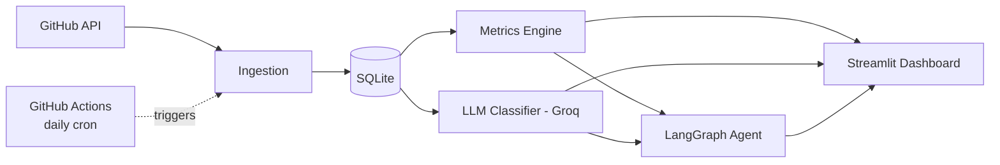

# Automated Code-Review & PR Bottleneck Analyzer

> Tracks GitHub PR idle time, classifies review comments with an LLM, and
> surfaces review bottlenecks for engineering managers — with an AI agent
> that diagnoses why a PR is stuck and drafts a nudge.

**[Live Dashboard →](your-streamlit-link-here)**

## Results
| Metric | Value |
|---|---|
| PRs analyzed | 608 (scikit-learn/scikit-learn) |
| Review comments ingested | 6,660 (326 bot, excluded from analysis) |
| Median time-to-first-review | 17.8h |
| Median time-to-merge | 64.7h |
| Open non-draft PRs stalled (>7d idle) | 49/86 (57%) |
| Comments classified | [your real number] |
| Stalled-PR agent reports generated | 205/206 |
| Daily pipeline runtime (incremental) | ~3.5-4.5 min (vs. ~12 min first run) |

## What it does
[2-3 sentences, plain language]

## Architecture
[diagram]

## Design Decisions
[pull from every milestone's "decision points" — REST vs GraphQL, hybrid schema,
human-event idle time, LangGraph typed state, commit-back vs cache, etc.]

## Known Limitations
[the honest list above]

## Setup
[clone, .env, pip install, run order]

## Tech Stack
Python · GitHub REST API · SQLite · Groq (openai/gpt-oss-20b) · Streamlit · LangGraph · GitHub Actions

