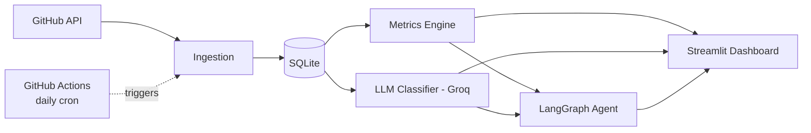

# Automated Code-Review & PR Bottleneck Analyzer

> Tracks GitHub PR idle time, classifies review comments with an LLM, and
> surfaces review bottlenecks for engineering managers — with an AI agent
> that diagnoses why a PR is stuck and drafts a nudge.

**[Live Dashboard →](PASTE_YOUR_STREAMLIT_LINK_HERE)**

## Results

Analyzed against `scikit-learn/scikit-learn`:

| Metric | Value |
|---|---|
| PRs analyzed | 608 |
| Review comments ingested | 6,660 (326 bot-authored, excluded from analysis — 4.9%) |
| Median time-to-first-review | 13.3h |
| Median time-to-merge | 18.2h |
| PRs with no response yet | 167 / 608 (27%) |
| Open non-draft PRs stalled (>7 days idle) | 215 / 241 (89%)¹ |
| ...waiting on reviewer vs. author | 138 reviewer / 77 author |
| Review comments classified (open PRs) | 463 |
| Comment category breakdown | 135 architectural · 107 question · 94 nitpick · 75 other · 52 approval |
| AI-generated stuck-PR diagnoses | 205 / 206 |
| Daily pipeline runtime | ~3.5–4.5 min incremental (vs. ~12 min first run) |

¹ *High stalled-rate is driven by scikit-learn's long tail of older open PRs in the ingested
sample; restricting to PRs opened in the last 60 days would likely show a lower, more
representative rate. Worth adding as a dashboard filter — see Next Steps.*

## What It Does

Pulls open and recently-closed PRs from a GitHub repo, computes idle time / time-to-first-review /
time-to-merge per PR, classifies review comments by intent (nitpick, architectural, question,
approval, other) using an LLM, and surfaces the result on a dashboard: which PRs are stalled, who
they're waiting on, and what kind of review conversation is actually happening. A LangGraph agent
then reads a stalled PR's metrics and classified comments, diagnoses why it's stuck, and drafts a
nudge message a maintainer could send.

## Architecture



Pipeline: GitHub REST API → ingestion (raw JSON + extracted columns in SQLite) → metrics engine
(idle time, TTFR, TTM, "waiting on") → LLM classifier (Groq, structured JSON output) → Streamlit
dashboard + LangGraph diagnosis/nudge agent. GitHub Actions runs the whole pipeline daily and
commits the updated database back to the repo.

## Tech Stack

Python · GitHub REST API · SQLite · Groq (`openai/gpt-oss-20b`) · LangGraph · Streamlit ·
GitHub Actions

## Design Decisions

- **REST over GraphQL for ingestion.** GraphQL could fetch a PR with its comments in one query,
  but REST responses are easier to inspect and debug, and the extra API calls stay well within
  rate limits at this scale.
- **Hybrid SQLite schema.** Every table stores the raw GitHub JSON payload alongside a few
  promoted columns (author, timestamps, state), so nothing has to be re-fetched and most queries
  stay simple SQL.
- **Idle time from human events, not `updated_at`.** GitHub's `updated_at` is bumped by bots,
  labels, and CI — it doesn't reflect real review activity. Idle time here is computed from the
  most recent non-bot comment, review, or commit.
- **"Waiting on" classification.** If the last human event was the PR author's, the PR is
  waiting on a reviewer, and vice versa — turning "this PR is idle" into "this PR is idle *and
  here's who's the bottleneck*."
- **LangGraph with typed state, not chat messages.** This is a fixed 3-step pipeline
  (gather context → diagnose → draft nudge), not an open-ended conversation, so a typed dict that
  accumulates fields was simpler and more testable than a running message list.
- **Diagnosis and nudge are separate nodes.** Diagnosis is analytical and grounded strictly in
  retrieved data (low temperature); the nudge is persuasive and tonal (higher temperature). Splitting
  them means the nudge's tone can be tuned without touching the diagnosis logic.
- **Nudges are drafts only — never auto-posted.** No GitHub API call sends them. This is a fixed
  scope line: auto-commenting on a real open-source project's PRs crosses from "portfolio tool"
  into spam.
- **SQLite committed back to git via CI, not a hosted DB.** GitHub Actions runners are stateless;
  committing `prs.db` back after each run is simpler than a cache (which can be evicted) and gives
  a visible history of the dataset growing. Documented tradeoff: this doesn't scale past ~100MB
  (see Known Limitations).
- **Classification scoped to open PRs only.** Groq's free tier caps daily tokens; scoping to open
  PRs keeps the classifier focused on *current* review activity and fits the dataset inside the
  daily budget, with the backlog clearing incrementally via the daily cron.

## Known Limitations

- **No formal hand-labeled accuracy evaluation.** The classifier was spot-checked manually across
  categories, not scored against a dedicated labeled test set. Real-world accuracy, especially on
  the nitpick/architectural boundary, is unverified. A proper evaluation (~50 labeled examples,
  per-class precision/recall) is a natural next step.
- **Classification is scoped to open PRs.** Closed/merged PR comments are ingested but not
  classified, due to Groq free-tier daily token limits.
- **No per-reviewer attribution.** GitHub's *requested reviewers* field isn't ingested, so the
  dashboard and agent can say a PR is "waiting on a reviewer" but not name a specific person.
- **Draft→ready transitions aren't tracked.** Time-to-first-review for PRs that spent time as a
  draft is inflated, since there's no timeline-event data marking when a PR left draft status.
- **TTFR counts any non-author comment**, including logistics replies, not just substantive
  review — a deliberate choice to capture "someone responded," but worth knowing when reading the
  number.
- **`prs.db` committed directly to git** currently sits at ~62MB and will keep growing via daily
  commits; this approach doesn't scale past ~100MB (GitHub's hard push limit).
- **High "stalled" rate (89%)** reflects scikit-learn's long tail of older open PRs in the dataset
  more than typical day-to-day review health; a recency filter would give a more representative
  number.

## Challenges & What I'd Do Differently

A few real issues came up mid-build, worth naming rather than hiding:

- **Groq deprecated `llama-3.3-70b-versatile`** partway through the project, breaking both the
  classifier and the agent with no warning. Fixed by making the model name a config variable from
  the start, so recovery was a one-line change plus a model-list lookup, not a rewrite.
  
- **Groq's free-tier daily token cap (200K/day)** meant classifying thousands of comments in one
  run wasn't possible. Fixed by scoping classification to open PRs only, and leaning on the
  classifier's existing resumability (per-row commits, skip-if-already-labeled) so the daily cron
  backfills the remainder automatically over several days.

- **Skipped formal hand-labeled accuracy evaluation** due to time constraints, choosing to spot-check
  manually and document the gap honestly instead of claiming an unverified number.

## Next Steps

- Hand-label ~50 comments and report real classifier accuracy / F1
- Ingest requested-reviewers data for per-person attribution
- Add a "PRs opened in the last N days" dashboard filter to reduce stale-PR skew
- Migrate `prs.db` to a hosted Postgres instance (e.g. Supabase) once it approaches 100MB
- Ingest timeline events to track draft→ready transitions

## Setup

```bash
git clone https://github.com/RohitKumarkolli/pr-bottleneck-analyzer.git
cd pr-bottleneck-analyzer
python -m venv .venv && source .venv/bin/activate   # Windows: .venv\Scripts\activate
pip install -r requirements.txt
cp .env.example .env   # fill in GITHUB_TOKEN, GROQ_API_KEY

python -m src.ingestion.ingest
python -m src.metrics.compute
python -m src.classifier.classify
python -m src.agent.run
streamlit run dashboard/app.py
```

## Roadmap

- [x] M0 Setup
- [x] M1 Ingestion
- [x] M2 Metrics
- [x] M3 LLM classifier (classification done; formal eval outstanding — see Next Steps)
- [x] M4 Dashboard
- [x] M5 Automation
- [x] M6 Agent layer
- [x] M7 Portfolio polish